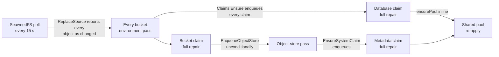

# Performance and robustness plan

Prepared **9 October 2026** against source commit `71716e8` (v0.1.1). It
builds on the [deployment performance report](performance-report.md), which
measured the delays; this document explains where they come from and lays
out the work to remove them. It also covers the robustness of the other
long-running processes: deploy, backup, restore, credential rotation, and
environment removal.

**Short version.** In the measured traces, kernel passes took about 14
seconds each. About 18 of the 23 environments were always waiting in a
queue served by two workers. Every rollout handoff, such as promotion to
first pass or Pod Ready to traffic switch, therefore waited one full trip
through that queue: roughly 100 seconds. Most of the work in that queue
creates itself:

- a 15-second SeaweedFS poll re-enqueues every bucket environment whether or
  not anything changed;
- every environment pass re-enqueues full repair of all its claims;
- the claim passes then fan out to the object store and the shared pool.

All of this, together with the kernel's own applies, runs through **one
Kubernetes client limited to 5 requests per second**. The database is
also about 20 ms away from skalid, which makes each journal step cost
0.35–0.5 seconds.

None of this needs a new engine. The first phase is small:

- an explicit client request budget;
- change detection in the observation store;
- not re-repairing provisioned claims on every pass.

Together these should remove the backlog. The later phases make passes
cheap, bound every external wait, and close the run-ownership and
cancellation bugs found along the way.

## Contents

- [What the investigation found](#what-the-investigation-found)
- [Robustness findings](#robustness-findings)
- [Plan](#plan)
- [Sequencing](#sequencing)
- [Targets and validation](#targets-and-validation)
- [Decisions for the owner](#decisions-for-the-owner)

## What the investigation found

### Every rollout handoff waits one full queue cycle

The kernel finishes a rollout over several passes, and each pass ends at an
external wait:

| Handoff | Pass before | Pass after |
| --- | --- | --- |
| Promotion | (API commits the target) | renders, records claims, creates the release Job |
| Release Job complete | waited on the Job | applies the new application color |
| New color available | applied the Deployment | switches the Service selector |
| Selector observed | switched traffic | activates the revision |
| Drain elapsed | activated | prunes the old color |

The event that ends each wait arrives within a second. It calls
`Kernel.Enqueue`, which puts the environment at the **back** of the queue
(`internal/reconcile/kernel.go:249`). If the environment's pass is still
running, the workqueue marks the key dirty and re-adds it at the back when
the pass finishes. The handoff therefore costs one full queue cycle:

```
cycle ≈ queued environments × pass duration ÷ workers
      ≈ 18 × 12–14 s ÷ 2 ≈ 110–125 s
```

The traces agree:

| Source | Value |
| --- | --- |
| Queue samples (`queue-observations.jsonl`) | 11–21 queued, mean 18.3, 2 workers |
| Warm restart pass, journal timestamps | 22:07:13.96 → 22:07:28.28: **14.3 s** |
| Corrected deploy, first pass | 21:59:23.97 → 21:59:38.20: **14.2 s** |
| Measured handoff gaps | 47–130 s |

The warm restart shows the mechanism directly. The replacement Pod became
Ready at 22:07:24, **while the pass that created it was still running**
(its last step was written at 22:07:28). The Ready event marked the
environment dirty and sent it to the back of the queue. The next pass
started at 22:09:14, about 105 seconds later, switched traffic, and
activated the revision.

Promote itself took 4 s (`promote` step 22:05:33.88 → 22:05:37.85). It was
waiting on the environment lock while a pass for the same environment ran.

### Why a pass takes 14 seconds

**The Kubernetes request budget.** `kube.NewFromConfig`
(`internal/kube/kube.go:114`) sets no QPS, so client-go v0.36.2 gives each
REST client a 5 QPS / burst 10 token bucket (`rest/config.go:374-381`).

- All of these share the **dynamic client's** bucket: kernel applies,
  substrate applies and reads, the metrics sampler, and the CNPG and edge
  informer lists.
- `Apply` is always a GET followed by a PATCH (`kube.go:216`, `:257`).
- A converged app with one TLS route, one database, and one bucket costs
  about 21 requests per pass.
- In the warm restart the last few applies of `web` took about 6 s, close to
  0.5 s per request. That is what about four sequential callers sharing a
  5/s bucket would see.

The captured daemon logs contain no client-go throttle lines. That neither
confirms nor rules out throttling: client-go logs at the default verbosity
only when a *single* wait exceeds 1 s (`rest/request.go:679-690`), and four
callers sharing the bucket each wait about 0.8 s. Phase 0 measures the wait
directly.

**Database round trips.** `/healthz` is a single `DB.Ping` and takes 24 ms,
so skalid is about 20 ms from `skali-db`. That suggests the two pods run
on different sites; it has not been checked yet.

| Database work | Cost |
| --- | --- |
| Pass on a converged environment | About 41 statements and 3 transactions, plus a new physical connection for the environment lock (`internal/store/environment_lock.go:17`): TCP, TLS, auth, prepare, lock. At 20 ms per round trip, about 1–1.5 s. |
| Each journal step | Several statements; the traces show 0.35–0.5 s per step. A rollout pass writes 5–8 steps. |
| Redundant reads within one pass | The target 3×, the revision row and full decode 2×, every pinned secret's ciphertext 2× (plus decrypt), the bucket-claim list 3×, the database-claim list 2×. |

**The substrate queue.** Every environment pass triggers substrate work
that competes for the same dynamic budget:

| Substrate pass | Dynamic-client requests | Other cost |
| --- | --- | --- |
| Database claim | About 14 | Re-applies the shared pool inline |
| Bucket claim | About 6 | 1 `weed shell` exec, 4 S3 GETs |
| Object store | About 30 | 2 execs |

For one environment with a database and a bucket, the substrate alone asks
for about 64 dynamic requests per 15 s, close to the whole 5/s budget,
before the kernel applies anything.

### Why the queue never drains

The backlog creates itself. This is the steady-state chain, confirmed in the
source:



| Trigger | Where | Effect |
| --- | --- | --- |
| Identical SeaweedFS poll | `observe/store.go:159-176`, `:222-258`; `pollsource.go:129-134` | `upsertLocked` always returns the owner, and the object-store object fans out to every bucket environment: about 12 environments every 15 s |
| Informer updates, including the 5-minute resync | `observe/kubesource.go:415-419` | Every update enqueues, even when the projection is identical; every 5 minutes, every environment at once |
| CNPG Cluster status updates | `kubesource.go:436-444` | Fan out to every environment on the pool (15 on `pg17-shared`) |
| Environment pass | `substrate/claims.go:80`, `:189` | Every claim enqueued, including provisioned ones |
| Bucket claim pass | `substrate/bucket.go:95` | Object store enqueued every time |
| Object-store pass | `substrate/system.go:35` | Metadata claim enqueued every time |
| Unhealthy environment | `reconcile/reconcile.go:459` | Requeued every 15 s forever, with or without a rollout |
| Audit | `reconcile/kernel.go:351-361` | All 23 environments at once every 30 minutes |

Arrival works out to about one environment pass per second. Capacity is two
workers at about 14 s per pass, or about 0.14 passes per second. The queue
stays full, so a deployment's handoff waits behind other environments'
no-op work.

The status stream has the same weakness. Every invalidation, including each
identical poll, makes every open Studio tab recompute the full status
projection (about 9 queries, `api/status_handlers.go:252-322`). A bucket
environment gets 3–5 invalidations per 15 s.

### The report's hypotheses, revisited

| Report hypothesis | Status now |
| --- | --- |
| Unchanged observations and provisioned claims trigger more work | **Confirmed**, larger than described: one identical poll costs an environment pass plus about 4 substrate passes, every 15 s |
| That repeated work causes the long gaps | **Very likely.** It is the arrival side of a saturated queue; the cycle-time model matches both traces. Phase 0 confirms it. |
| Client throttling is a dominant bottleneck | **Very likely.** One 5/s dynamic budget is shared by kernel and substrate, and substrate demand alone is close to it. Not yet measured directly. |
| Database overhead | **New:** about 20 ms per round trip. It roughly doubles the cost of journal-heavy rollout passes. |
| Kubernetes itself is slow | **Not supported.** Pods were Ready 3–4 s after creation. |

## Robustness findings

The same investigation turned up bugs in the long-running processes. These
are the most important; all were checked against the code.

### Deploy

1. **#141 has a different cause than the issue suggests.** The live fixture
   does wire the kernel as enqueuer (`reconcile_live_test.go:111`). The race
   is about adoption:
   - `attachRun` adopts *any* running run of the environment. Runs carry no
     revision.
   - `Execute`-style runs have no deployment row, so they are adoptable
     before promotion.
   - A pass that read the *old* target (target equals active, healthy)
     takes the up-to-date branch of `activate` and finishes the *new* run
     as succeeded.
   - `journal.finish` force-closes running attempts as `cancelled` even when
     the run succeeds (`journal/service.go:174`), so the owner's next write
     fails with `cancelled -> succeeded`.

   Production has two variants:
   - `Promote` unlocks before it creates the rollout step;
   - `Restart` takes no lock between `StartRun` and stamping the restart.

   Either way a forced redeploy or restart can be marked succeeded before
   its work starts.
2. **Cancel can leave a revision rolling out with no run.** The cancel
   handler runs `FinishRun(cancelled)` *before* `FallbackTarget`
   (`api/deployments_handlers.go:705-722`). `FallbackTarget` waits on the
   environment lock under the CLI's 15 s timeout. If it times out, the run
   is cancelled but the target still points at the new revision. The
   kernel then activates it with no run, no deadline, and no fallback. The
   rollout deadline only applies while a run is attached
   (`reconcile.go:422`).
3. **Healthy deploys can hit the deadline.** The 10-minute budget runs from
   `target.UpdatedAt` and includes every queue wait. At about 100 s per
   handoff, a deploy with a new claim, a migration, and blue-green can
   exceed it. If the deadline trips in the pass that just switched traffic,
   traffic flips back (`reconcile.go:434-449`). After a successful
   migration, that leaves old code on the new schema.
4. **The environment lock has no timeout, and kube calls have none either**
   (`rest.Config.Timeout` is unset). One hung API call pins a worker and the
   lock. Promote, Rollback, Teardown, and cancel then queue behind it until
   the 30 s request timeout.
5. **Runs leak as `running` and block deploys.**
   - Cleanup on open uses the request context (`deploy/open.go:520`).
   - A reconcile run created by a pass that returns early is never finished.
   - Ctrl-C during a build leaves a `preparing` deployment that blocks the
     environment for 30–90 minutes. The stale sweep runs hourly, and the
     error message does not name the run.
6. **Release Jobs can re-run or be killed.**
   - A failed Job created in the same second as the promotion counts as "an
     earlier attempt" and runs again: `Created` has 1 s precision and
     `UpdatedAt` microseconds (`reconcile/release.go:67`; `tls.go:330`
     already truncates).
   - A fallback prunes a running migration Job.
   - Eviction fails the release with no useful diagnostics.
7. **Removed claims are destroyed before activation.** `Claims.Ensure`
   releases a database or bucket that the new revision dropped on the
   *first* pass after promotion (`substrate/claims.go:104-135`). A failed
   rollout falls back, but the data is already being dropped.
8. **skalid upgrades overlap two processes.** The skalid Deployment has one
   replica and the default RollingUpdate strategy (`bundle/bundle.go:1232`),
   with no leader election. The new pod's boot recovery fails work the old
   pod is still driving. SIGTERM cancels in-flight completions without
   draining them.

### Backup, restore, rotation

1. **A cancelled restore that is still queued takes the environment down
   anyway.**
   - `process` claims a pending row without checking its run
     (`backup/backup.go:34-50`).
   - The restore runs its `target`, `snapshot`, and **`stop`** steps before
     its first cancellation check (`backup/restore.go:150-196`).
   - Cancel only touches the journal; it reaches neither the row nor the
     copy.
2. **Run slots leak.**
   - A redactor error fails the row without finishing its run
     (`backup.go:55-58`).
   - Accept-time cleanup uses the request or scheduler-tick context, which
     may already be dead.
   - Either way the environment's single run slot stays `running` until
     someone cancels it by hand.
3. **One backup worker serves the whole installation, and queued runs hold
   their slot** (`backup/controller.go:92-95`).
   - With the default `0 3 * * *` schedule, every environment's run becomes
     `running` at 03:00. Deploys and restores are blocked until each backup
     has been processed in turn.
   - A restart in that window fails every queued backup. Their schedules
     were already advanced, so nothing runs until the next night.
4. **In-process bucket copies have no deadline**, and minio-go has no
   body-read timeout. A stalled volume server wedges the only worker until
   restart.
5. **Restores destroy before they verify.**
   - The bucket is cleared before the copy starts.
   - `pg_restore` runs without `--single-transaction`.
   - Nothing marks a failed restore, so the next deploy resumes the
     application on partial data.
6. **Volume backups may hang on multi-node Longhorn.** The volumes are
   ReadWriteOnce and the Job has no node affinity. *Inferred from the
   access mode and storage class, not reproduced.*
7. **Credential retirement runs on a fixed clock from commit.** If
   consumers never roll, the old credentials are still revoked at the
   deadline. A second rotation inside the window cuts off the previous
   one's stragglers immediately.

### Environment removal (#142)

- The teardown step never shows the substrate's waiting reasons
  (`substrate/teardown.go:28-61`).
- A second `remove` cancels and restarts the teardown.
- The database is dropped in the same pass that deletes the namespace,
  while application pods are still terminating and connected. That likely
  explains the 7-minute drop.

## Plan

**Principles.**

- Ship one change per pull request.
- Measure before and after with the existing collector.
- Keep the existing recovery guarantees (level-triggered convergence from
  durable intent; periodic repair of state no watch covers).
- Any change that alters semantics gets a setting or a clean revert.
- Unit tests prove the new contract; the live suite runs only on the
  disposable test cluster.

### Phase 0 — Attribution (small, first)

Add enough instrumentation to confirm the model and to compare each later
change. Expose it on the admin observation endpoint, which the collector
already samples, rather than wiring a metrics backend first.

1. **Queue accounting** in `Kernel.Enqueue`/`worker` and substrate
   `processNext`:
   - enqueue counts by reason: promotion, watch change, poll, claim,
     requeue, resync, audit;
   - queue wait, measured from the first eligible enqueue to worker start;
   - pass duration;
   - substrate queue depth, which is not reported today.
2. **Request-budget wait.** Wrap the client's `RateLimiter` with one that
   records time spent waiting. Count requests by verb, kind, and caller.
3. **Database round trips per pass**, plus lock-connection setup time and
   lock-wait time.
4. **A one-off placement check:** which nodes and sites `skalid` and the
   `skali-db` primary run on.
5. **Per-pass debug log line** with phase durations: lock, reads, render,
   claims, apply, TLS, health, journal.

*Acceptance:* the warm-restart trace can be split into queue wait, throttle
wait, database time, and external waits, with the 14 s pass explained to
within a second or two.

### Phase 1 — Stop the self-inflicted load

These changes are small and independent, and they remove the backlog.

1. **Explicit request budget.**
   - Set `QPS`/`Burst` in `kube.NewFromConfig`, configurable through the
     daemon config. Start around 50/100, as `internal/hostdaemon` already
     does.
   - With QPS set, the typed clientset shares one limiter
     (`clientset.go:498`) and the dynamic client gets its own.
   - The k3s API server protects itself with priority and fairness.
   - This is safe as a hotfix on its own, because current demand is bounded
     by the 15 s poll (estimated at about 20 QPS of no-op work). Items 2–4
     remove that work.
2. **Change detection in the observation store.**
   - `upsertLocked` compares the new projection with the stored one and
     reports affected owners only on a real difference, an owner change, or
     a shared-key change. The projections are small value structs, so the
     comparison is cheap.
   - `ReplaceSource` reports only additions, removals, and changes.
   - Informer handlers enqueue only on change. That makes the 5-minute
     informer resync a no-op; the kernel's own resync and audit remain the
     correctness floor.
   - Status-stream invalidations use the same signal.
   - Source freshness stays independent of equality. A successful poll
     still refreshes liveness. A stale → fresh transition explicitly
     enqueues environments whose target is not yet active.
   - Replace `TestReplaceSourceReconcilesObjectSet`'s expectation with tests
     covering:
     - identical snapshots → zero enqueues;
     - a nested status change;
     - an owner move;
     - a shared-reference change;
     - removal;
     - stale → fresh recovery with an identical snapshot.
3. **Do not repair provisioned claims on every pass.**
   - `Claims.Ensure` enqueues a claim only when it is unsettled, its spec or
     extensions changed, or a rotation or release is in flight. It still
     reports readiness and still writes the claim row when it changes.
   - Move routine drift repair of provisioned claims to the substrate's
     resync, at an explicit, jittered cadence (for example every 10
     minutes, spread across the interval). Unwatched state — output
     mirrors, bucket identities and policies — is still repaired within a
     known bound.
   - Also:
     - a bucket claim enqueues the object store only while it is not
       ready;
     - the object-store pass enqueues the metadata claim only while it is
       unsettled;
     - a database claim stops running `ensurePool` inline once the pool is
       ready (the pool has its own work key and resync).
4. **Make the bucket pass's external checks conditional.**
   - Skip the `weed shell s3.configure` exec when the identity matches what
     was last applied (keep an in-memory digest per bucket, cleared on
     restart, rotation, or fence).
   - Drop the duplicate configuration check. The 15 s maintenance loop and
     the claim pass both run the four S3 GETs today.
5. **Spread periodic enqueues.** Audit and resync enqueue environments
   spread across their interval instead of all at once. Unhealthy
   environments **without** a rollout back off: 15 s, then 30 s, 1 min,
   capped at about 5 minutes. Any real event resets the backoff.

*Expected effect:* a steady-state queue depth near zero, so each handoff
costs about one pass. Substrate traffic should drop by an order of
magnitude. **Needs measurement:** passes may still take a few seconds
because of database round trips.

### Phase 2 — Cheaper, bounded passes

1. **Bound everything external.**
   - Set `rest.Config.Timeout` for non-watch requests (for example 30 s).
   - Give each kernel pass and each substrate item its own deadline (for
     example 2 minutes).
   - Give execs and S3 calls explicit timeouts, and reuse one S3 transport
     instead of building a new client per call.
   - Fix the policy flapping: a failed CIDR lookup should skip the apply,
     not render the policy without its rule.
2. **Environment lock.**
   - Replace connect-per-pass with a small dedicated lock pool sized for the
     workers plus API callers. Unlock explicitly, and discard the
     connection if unlock fails.
   - API callers (Promote, Rollback, Teardown, cancel) wait with a bounded
     `pg_try_advisory_lock` retry loop. On timeout they answer a clear
     "environment busy (pass in progress)" error instead of hanging.
   - Kernel passes keep the blocking form, bounded by the pass deadline.
3. **Skip no-op PATCHes.**
   - Keep the GET and the ownership checks. Compare the desired applied
     configuration with the fields `skalid-project` owns on the live object
     (extract them from `managedFields`, as client-go's apply extractors
     do), and skip the PATCH when they are equal.
   - This handles fields removed from the desired state, which a plain
     desired-subset comparison misses. Start with Deployments, Services,
     IngressRoutes, Middlewares, and NetworkPolicies.
   - Later, read observed kinds from the informer cache instead of a live
     GET, falling back to a live GET on any doubt.
   - Keep the live GET for Secrets.
   - HPA ownership transitions keep their explicit path.
4. **Remove repeated database work within a pass.**
   - Read the target once.
   - Cache decoded revisions by ID; they are immutable.
   - Decrypt pinned values once and share them between the render and the
     redactor. Build the redactor lazily, only when the pass journals.
   - Read the claim lists once and pass them to `Ensure`, `Generations`,
     and `BucketNames`.
   - Batch the per-secret ciphertext reads into one query.
5. **Make journal writes cheaper.** Write a completed step (ensure, start,
   attempt, logs, finish) in one transaction or one statement instead of
   about six round trips. This also speeds up the API-side deploy steps,
   which now take 0.35–0.5 s each.
6. **Place skalid near its database.** If Phase 0 confirms they run on
   different sites, prefer scheduling skalid on the `skali-db` primary's
   node or site. Use a soft affinity, because failover moves the primary.
7. **Status stream.** Coalesce invalidations (for example over 250 ms) and
   compute one status per environment, shared by all subscribers, instead
   of one per open tab.

### Phase 3 — Prompt handoffs

Once Phase 1 empties the queue, handoffs are mostly fast already. This phase
keeps them fast under load: many deploys at once, the boot audit, a burst
of real events.

1. **Priority for active rollouts.** Use one queue with two priority
   classes and a single dirty/processing record per environment, so an
   environment is never processed twice at once.
   - Environments with an attached rollout run, or with target ≠ active,
     are urgent.
   - A queued background key that becomes urgent is promoted in place.
   - Keep fairness: for example, one background item for every N urgent
     ones.
2. **Write apply results through to the observation store.** The apply
   response is the API server's truth. Upsert its projection when its
   resourceVersion is newer than the stored one. This has two effects:
   - The pass that switches the Service selector can activate in the same
     pass instead of waiting another hop.
   - It closes a possible window, not confirmed, in which a post-apply
     snapshot still shows the old healthy Deployment and a rolling-update
     revision activates before any new pod exists.
3. **Configurable worker counts** for the kernel and the substrate. Measure
   2, 4, and 8 workers at a fixed load once the request budget and database
   costs are known.
4. **Make the rollout deadline independent of the journal and of queueing.**
   - Persist the rollout start on `environment_targets` and enforce the
     deadline whether or not a run is attached.
   - Count the release budget from the Job's creation, not from promotion.
   - Never fall back in the pass that just moved traffic: give the new
     color one confirmation pass first.

### Phase 4 — Deploy robustness

1. **Run ownership (#141).**
   - Record the target revision on the run, or create the `rollout` step,
     inside the Promote transaction as the handoff marker.
   - `attachRun` adopts a deployment, restart, or rollback run only after
     that marker exists.
   - `activate` finishes only a run whose recorded revision equals the
     target it activated.
   - `Restart` takes the environment lock around stamping.
   - `journal.finish` must not mark a still-running owner's attempt
     `cancelled` on success. With single ownership it no longer has to.
   - Add a deterministic test that holds a pass between reading the target
     and finishing the run while a second deploy promotes.
2. **Cancel in the right order.**
   - Under the lock: fall back first, then finish the run with the real
     outcome.
   - Use a detached context with a bounded lock wait, so a CLI timeout
     cannot leave the work half done.
   - Report accurately when the revision was already active.
   - Define what cancelling a *first* deployment means; it has nothing to
     fall back to.
3. **Release Jobs.**
   - Compare `Created` with `target.UpdatedAt.Truncate(time.Second)`, or
     better, label the Job with the promotion it belongs to.
   - Add a `podFailurePolicy` that ignores disruption (eviction, preemption,
     node loss) so those retry, while the command's own failure stays
     final.
   - Let a running release Job finish or time out instead of pruning it on
     fallback.
   - Surface Pending, ImagePullBackOff, and config errors in the step while
     waiting.
4. **Release removed claims only after activation**, so a rollout that falls
   back has not already dropped data.
5. **Stop runs leaking.**
   - Run every cleanup on detached contexts.
   - Finish any run a pass created on early return.
   - Name the blocking run in "in flight" errors.
   - Let a deploy supersede a drift-healing `reconcile` run instead of
     failing.
   - Add a SIGINT handler in the CLI that fails a `preparing` deployment.
   - Run the stale sweep every few minutes instead of hourly.
6. **skalid process lifecycle.**
   - Use the `Recreate` strategy for the single-replica skalid Deployment,
     or add leader election.
   - On SIGTERM, stop accepting work and let in-flight completions reach a
     safe point before the loops are cancelled.
   - Resume, rather than fail, completions that died between artifact
     verification and Promote: everything they need is persisted.
7. **CLI resilience.** Retry idempotent reads with backoff, keep `attach`
   alive across a daemon restart, and show a **queued** state distinct from
   executing and waiting. The report's "progress timing describes actual
   work" item belongs here.
8. **Environment removal (#142).**
   - Make a repeated `remove` return the running teardown.
   - Delete workloads and wait for pods to be gone *before* releasing the
     database claim.
   - Show each claim's substrate waiting reason in the step and log release
     progress.
   - Have `skali env remove` attach, ending cleanly when the environment row
     disappears.
   - The bucket tree walk stays tracked in #142.

### Phase 5 — Backup, restore, and rotation robustness

1. **Cancellation that stops work.**
   - Route cancel of a backup or restore run to the controller.
   - A pending row moves to `cancelled` and never starts.
   - A running row's context is cancelled, which interrupts copies and Job
     waits.
   - Check the run's status before claiming a row and before the restore's
     `stop` step.
   - Ignore step writes on a terminal run.
2. **No leaked run slots.**
   - Finish the run on every `failRow` path.
   - Do accept-time cleanup on detached contexts.
   - Add a sweep for backup and restore runs whose row is terminal or
     missing.
3. **Queueing.**
   - Take the environment's run slot when the worker *starts* the row, not
     at accept, so queued backups do not block deploys.
   - Allow a small number of concurrent backups on different environments.
   - Order restores ahead of scheduled backups.
   - Recover `pending` rows at boot by re-enqueueing them; they never
     started. Fail only rows that were `running`.
   - Spread scheduled times: derive a per-environment minute offset from
     the environment ID for the default schedule.
4. **Deadlines and retries.**
   - Give in-process copies a per-component deadline plus stall detection
     (no progress for N minutes).
   - Retry Job-status reads and the restore's stop polling on transient
     errors.
   - Retry a failed scheduled backup once inside its window.
5. **Restore safety.**
   - Verify the snapshot (manifest, sizes, checksums) before anything
     destructive.
   - Restore a database with `--single-transaction`, or into a fresh
     database that is then swapped in.
   - Persist "restore incomplete" on the environment so a deploy refuses to
     resume it silently.
   - Fail a bucket restore on a count mismatch after re-listing the
     destination.
6. **Volume Jobs.**
   - Schedule the Job on the node where the ReadWriteOnce volume is
     attached.
   - Give the pods resource requests.
   - Bound the multipart part size.
   - Fix the quadratic untar.
   - Treat a file changing during the tar as a warning, not a failure.
   - First check whether the Longhorn multi-attach problem is real.
7. **Rotation.**
   - Start the retirement clock when consumers have rolled, or hold
     retirement while old pods still exist, with an upper bound.
   - Refuse a second rotation inside the overlap window unless it is
     forced.
   - Fix the rolled-pod check so a pod created during the 3 s poll lag
     counts as rolled.
8. **Garbage-collect partial snapshots** that no manifest references, after
   a grace period.
9. **Progress for long Jobs:** dump and restore byte counts from the worker,
   and object counts during inventory, so a 40-minute step does not look
   hung.

## Sequencing

Each line is one pull request. They are ordered so that each one can be
measured on its own. Phase 1 is the priority; it should deliver most of the
latency gain.

| # | Change | Phase | Size | Depends on |
| --- | --- | --- | --- | --- |
| 1 | Queue, request-wait, and DB-per-pass instrumentation; substrate queue depth in the observation endpoint | 0 | S–M | — |
| 2 | Explicit client QPS/burst, configurable | 1 | S | — |
| 3 | Observation change detection plus source-recovery enqueue | 1 | M | 1 |
| 4 | Provisioned claims leave the per-pass path; jittered substrate repair cadence; conditional object-store and metadata enqueue | 1 | M | 1 |
| 5 | Conditional identity exec and de-duplicated bucket configuration checks | 1 | S | 4 |
| 6 | Spread audit/resync; back off unhealthy environments without a rollout | 1 | S | 3 |
| 7 | Timeouts: REST client, pass and item deadlines, S3/exec | 2 | M | — |
| 8 | Lock pool and bounded lock waits for API callers | 2 | M | 7 |
| 9 | De-duplicate per-pass reads; revision cache; lazy redactor | 2 | M | 1 |
| 10 | Single-round-trip journal step writes | 2 | M | 1 |
| 11 | No-op PATCH skip via owned-field comparison | 2 | M–L | 1 |
| 12 | Status stream coalescing and shared computation | 2 | S–M | 3 |
| 13 | Run ownership and adoption marker (#141), restart lock | 4 | M | — |
| 14 | Cancel ordering and accurate outcome | 4 | S | 8 |
| 15 | Rollout deadline on the target; no fallback in the switch pass | 3/4 | M | 13 |
| 16 | Apply write-through to observation | 3 | M | 3 |
| 17 | Priority lane with single-key serialization; configurable workers | 3 | M–L | 1, 3 |
| 18 | Release Job fixes (precision, disruption policy, no prune mid-run) | 4 | S–M | — |
| 19 | Release removed claims after activation | 4 | S | — |
| 20 | skalid `Recreate` strategy plus graceful shutdown | 4 | S | — |
| 21 | Leaked-run fixes and CLI SIGINT handling; faster stale sweep | 4 | M | 13 |
| 22 | Backup cancellation and run-slot leak fixes | 5 | M | — |
| 23 | Backup queueing: slot at start, concurrent workers, boot re-enqueue, schedule spread | 5 | M | 22 |
| 24 | Copy deadlines, retries, restore verification and safety | 5 | M–L | 22 |
| 25 | Teardown ordering and progress (#142) | 4 | M | — |
| 26 | Rotation retirement tied to rollout | 5 | M | — |
| 27 | CLI resilience and the queued/executing/waiting display | 4 | M | 1 |
| 28 | Volume Job placement and limits | 5 | M | — |

Items 22 and 2 fix a production outage risk and a hotfix-sized gain, so
they can go ahead of their phase. Items 13, 18, and 22 are correctness bugs
that are independent of the performance work.

## Targets and validation

The report's targets stand. Expected progress per phase:

| Metric | Measured | After Phase 1 (estimate) | Target |
| --- | --- | --- | --- |
| Queue depth, steady state | 11–21 (mean 18.3) | ≈ 0–2 | ≈ 0 except during bursts |
| Kernel pass, converged environment | 12–14 s | 2–4 s | < 1 s after Phase 2 |
| Promotion → first pass | 47–108 s | ≈ 1 s | p95 < 5 s |
| Pod Ready → traffic switch | 108–130 s | one pass, a few seconds | p95 < 5 s |
| Warm forced redeploy | 225 s | roughly 20–40 s | < 60 s, then 30 s |
| Substrate passes caused by an identical poll | about 4 per bucket environment per 15 s | 0 | 0 |

The "after Phase 1" column is a projection from the cost model. It is not
a measured result.

Validation follows the report's method:

- the warm redeploy with the collector, at least 30 runs per configuration;
- the scenario matrix;
- background environments at fixed load points.

Add two live tests that guard the new contracts:

1. With N idle bucket environments, the kernel queue settles near zero and
   identical polls cause no passes.
2. A deploy amid background work has bounded promotion-to-pass and
   Ready-to-switch latency.

Correctness coverage for each change follows the
[testing guide](testing.md). Live suites run only against the disposable
test cluster, never production.

## Decisions for the owner

1. **Should backups block deploys?** Queued backups should not hold the
   slot. While a database dump runs, a migration that needs an exclusive
   lock would wait on `pg_dump`. Keeping exclusivity while *running* is
   the conservative choice.
2. **skalid upgrades:** use the `Recreate` strategy (simple; a few seconds
   of API downtime per upgrade), or leader election with a Lease (no
   downtime, more code)? This plan assumes `Recreate` now and leader
   election with #115.
3. **Drift-repair bound for provisioned claims:** how long may an
   externally deleted output Secret or a changed bucket policy go
   unrepaired? This plan proposes 10 minutes.
4. **Default request budget:** start at 50/100 and tune from the Phase 0
   measurements.
