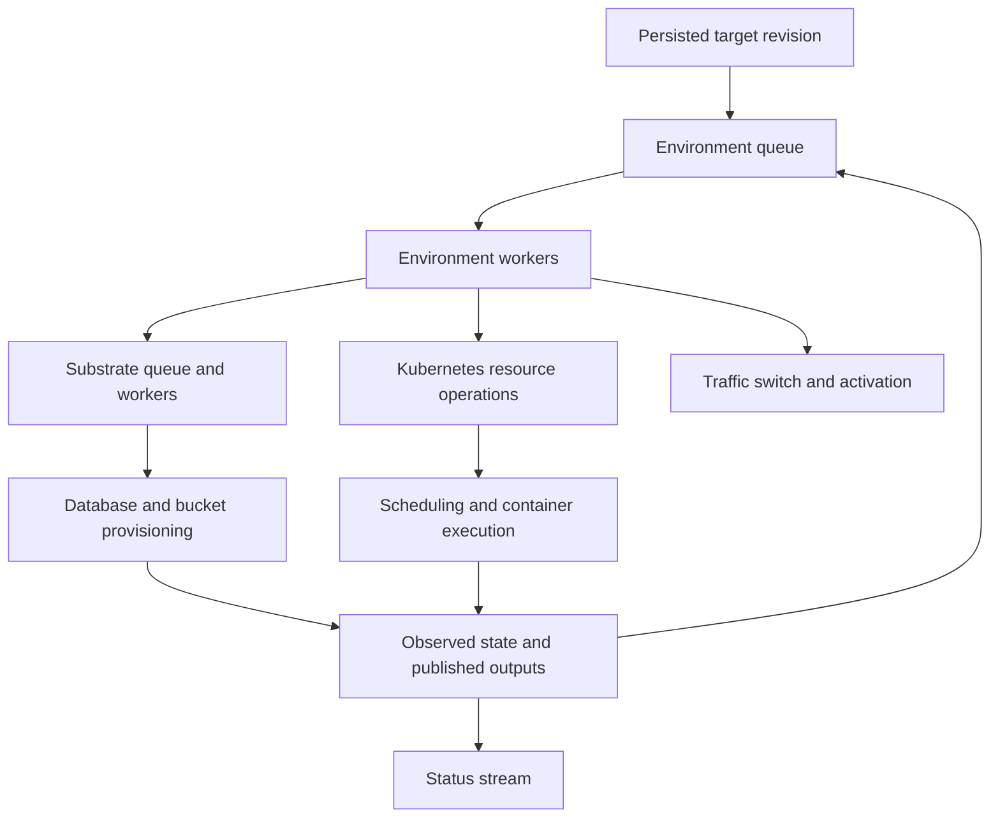

# Skali deployment performance report

Prepared **9 October 2026, Europe/Berlin**. Measurements were collected on
8 October from approximately 21:48 to 22:10 UTC, spanning late 8 October
and early 9 October in Berlin. This report describes **skali v0.1.1**, source
commit `71716e8`, and the production cluster measured in that window.

**Skali has substantial opportunities to reduce deployment latency within
its existing Kubernetes architecture. A custom container engine is not
required to address the delays demonstrated here.** A warm restart took
225.2 seconds although Kubernetes made its replacement Pod Ready in four
seconds. Long intervals before reconciliation and before traffic switching
dominated the result.

The recommended work is to reduce unnecessary reconciliation, make routine
passes cheaper, and process deployment transitions promptly. These are
implementation changes to the control plane, not merely faster dashboard
updates. The amount each change saves must be established by repeat
measurements; the current traces identify the delayed boundaries but do
not attribute every second to a particular internal call.

## Contents

- [Measured system and experiment scope](#measured-system-and-experiment-scope)
- [Measured deployment timelines](#measured-deployment-timelines)
- [Current architecture and likely causes](#current-architecture-and-likely-causes)
- [Prioritized implementation work](#prioritized-implementation-work)
- [Performance targets and validation](#performance-targets-and-validation)
- [Implementation sequence](#implementation-sequence)
- [Decision about a custom engine](#decision-about-a-custom-engine)
- [Evidence and source references](#evidence-and-source-references)

## Measured system and experiment scope

The cluster ran k3s **v1.36.3+k3s1** on 11 nodes, with ARM64 application
images for this test. There were 23 environments including the isolated
test environment. PostgreSQL 17 and SeaweedFS were already healthy shared
infrastructure. Creating the test database meant provisioning a logical
tenant on an existing PostgreSQL pool; it did not mean starting a new
PostgreSQL cluster. The S3 gateway was also already running.

The [deployment timing example](../examples/deployment-timing/README.md)
contains one Go application, one managed database, and one private bucket.
A release Job applies a transactional SQL migration and writes an S3
marker. The application checks both dependencies before reporting Ready.
Public HTTPS terminates at the skali edge. The manifest keeps the normal
startup/readiness defaults and blue-green rollout behavior.

Evidence came from Kubernetes watches and Events, application logs, skali
run journals, skali status SSE, queue samples, and external HTTPS probes.
The successful route was `02.timing.staging.khz.dev`. Authentication,
database and S3 round trips, missing keys, and body limits passed. Read-only
checks after the warm restart confirmed that the stored record and object
survived.

There are three relevant traces:

| Experiment | What changed | How to use the result |
| --- | --- | --- |
| Initial setup | New image, logical database, bucket, and hostname `01` | Infrastructure timings before the app crash only |
| Corrected deployment | Corrected image `v2` and hostname `02`; existing claims reused | Successful deployment including image build and new TLS issuance |
| Warm restart | Same active revision, image, values, database, bucket, and certificate | Successful rollout without build or new release Job |

The initial image had a bug in the test application: Go route registration
panicked because `GET /` conflicted with method-independent data routes.
That run was cancelled, the application was corrected, and a regression
check was added. Its total runtime is not a successful deployment baseline
or evidence of Kubernetes instability. Its migration, image pull, claim,
and certificate timings precede or operate independently of that crash.

Production background work continued. Sampled node CPU was low, and the
daemon had no configured CPU limit or recorded CPU throttling. Both
observation sources were fresh in the successful runs' samples. Database
diagnostics found no blocked advisory-lock requests in the sampled moment;
that does not rule out contention at other times.

The collector also added read requests and watch connections. No paired
uninstrumented control run was collected, so its overhead is not quantified.
The queue was already populated before the test's target promotion.

These are individual successful runs, not a latency distribution. Watch
timestamps include collection and network delay; many Kubernetes timestamps
have one-second precision. Only the control node's NTP synchronization was
checked. Cross-machine skew is therefore a limitation for small intervals,
although it is unlikely to explain delays of roughly two minutes.

## Measured deployment timelines

### Corrected deployment with new image and hostname

The server opened the deployment at 21:58:10.971 UTC and marked it successful
at 22:03:57.241 UTC: **346.3 seconds, or 5 minutes 46 seconds**.

| Boundary | UTC time | Interval of interest |
| --- | --- | --- |
| Deployment opened | 21:58:10.971 | Start |
| Build and upload finished | 21:58:31.162 | Build step took 17.7 s |
| Promotion finished | 21:58:36.537 | Verification and revision creation completed |
| First rollout pass started | 21:59:23.972 | **47.4 s after promotion** |
| Release Job created | 21:59:30 | |
| Release Job completed | 21:59:35 | About 5 s from creation |
| App Deployment created | 22:01:39 | **124 s after Job completion** |
| App Pod Ready | 22:01:42 | **3 s after creation** |
| Certificate updated for hostname `02` | 22:01:44 | |
| Certificate Ready | 22:02:13 | **29 s for issuance** |
| First successful external HTTPS response | 22:03:52.246 | **130.2 s after Pod Ready** |
| Deployment marked successful | 22:03:57.241 | 5.0 s after successful HTTPS |

The migration check took **59 ms**, with the SQL migration already applied.
The S3 marker write took **31 ms**. Dependency readiness was logged
**2.147 seconds after application process start**.

The application and certificate were ready while the public Service still
selected the previous failed color. Successful HTTPS arrived **99.2
seconds after certificate readiness**. This is a real traffic-routing delay,
not just delayed terminal output. The certificate interval overlaps the
readiness-to-traffic interval; it must not be added again.

The two largest gaps, Job completion to app creation and Pod Ready to
successful HTTPS, total **254.2 seconds**. They identify delayed transitions.
They are not direct measurements of queue wait alone: each boundary can
also include planning, locking, database reads, and Kubernetes API work.

### Warm restart with the existing image and certificate

The server opened the forced redeploy at 22:05:30.589 UTC and marked it
successful at 22:09:15.799 UTC: **225.2 seconds, or 3 minutes 45 seconds**.
The deployment API reused the active revision's artifacts and stored values,
avoiding local build-context evaluation. No new migration Job ran.

| Boundary | UTC time | Interval of interest |
| --- | --- | --- |
| Deployment opened | 22:05:30.589 | Start |
| Promotion finished | 22:05:37.853 | |
| First rollout pass started | 22:07:13.958 | **96.1 s after promotion** |
| Replacement Pod created | 22:07:20 | |
| Replacement Pod Ready | 22:07:24 | **4 s after creation** |
| External HTTPS returns replacement process | 22:09:12.666 | **108.7 s after Pod Ready** |
| Deployment marked successful | 22:09:15.799 | |

The old healthy Pod continued serving during the wait. The sampled HTTPS
requests observed no outage, and the final two application Pods had zero
restarts. The previous color was still present awaiting retirement at the
final snapshot.

The first-pass and readiness-to-traffic gaps total **204.8 seconds**, about
**90.9%** of the 225.2-second run. Subtracting those windows leaves 20.4
seconds, but **20.4 seconds is not a promised optimized runtime**. The
windows contain some necessary work, and the remainder belongs to this
particular trace. This arithmetic expresses the scale of the opportunity.

### Initial infrastructure timings

The initial setup yielded the following measurements before its failed
application start:

| Operation or boundary | Measured time | Interpretation |
| --- | --- | --- |
| First build and upload | 54.1 s | Included uncached Go dependency download |
| Promotion to first rollout pass | 107.7 s | Large delay before rollout processing |
| Database claim creation to CNPG Database object creation | 99.4 s | Includes substrate scheduling and pre-object provisioning work |
| Database claim creation to provisioned | 104.6 s | New logical tenant, existing PostgreSQL pool |
| Bucket claim creation to provisioned | 101.1 s | Existing object-storage platform |
| Release Job creation to completion | About 6 s | Scheduling, init, image pull, and process execution |
| Image pull | 599 ms | Small image, approximately 3.5 MB |
| Initial SQL migration | 71 ms | Actual first schema migration |
| S3 marker write | 247 ms | First test object write |
| Completed Job to app Deployment creation | 106 s | Another delayed continuation |
| Initial certificate creation to Ready | 29 s | Fresh hostname `01` |

These results support fast container and small migration execution on this
cluster. They do not establish the startup speed of large images, dedicated
database clusters, large migrations, or a fully cold platform.

## Current architecture and likely causes

### Events already drive reconciliation

Skali persists desired revisions and values, then converges actual state
toward that intent. Kubernetes observations arrive through LIST/WATCH
informers. SeaweedFS has a polling observer. Both feed an in-memory
observation store, and affected environments enter a workqueue. The
environment kernel and substrate controller have separate worker pools.



A completed release Job or newly Ready Pod normally causes another
environment pass. That pass makes the next decision, such as creating the
application or changing the Service selector. Receiving an event promptly
does not imply that the worker processes it promptly.

The CLI polls attached run state every 500 ms, and the status API supports
SSE. Changing that display cadence could improve perceived responsiveness,
but it cannot remove the measured delay before resources exist or before
traffic moves. The kernel also has a 15-second health fallback, substrate
waiting has a 10-second fallback, and periodic resync/audit provide recovery.
The measured 96–130-second gaps are much longer than those nominal fallback
intervals.

### Background work can keep the queues busy

The environment queue contained **11–21 pending keys across 100 samples**,
with a mean of 18.3 and **two environment workers**. The successful warm
run's own samples ranged 15–21. The substrate defaults to two workers as
well, although its queue depth was not included in these measurements.
Neither worker count is passed explicitly by the daemon wiring at this
version; constructor defaults take effect.

The queue deduplicates environment identifiers. Duplicate events therefore
do not create an unlimited list of duplicate entries, but repeated events
can keep an environment runnable after a pass completes. A sustained queue
of distinct environments can create long waits even with low CPU usage,
because workers spend time on database, Kubernetes, and provider I/O.

Source review identifies this repeating path:

1. SeaweedFS is polled every 15 seconds. `ReplaceSource` upserts every
   returned observation and reports affected environments even when the
   observations are unchanged. The shared object-store observation reaches
   all environments referencing that store.
2. An environment pass calls `Claims.Ensure`. That method enqueues existing
   database and bucket claims even when already provisioned.
3. Provisioned claim workers still walk their drift-repair paths, including
   credentials, outputs, pools, database objects, or external S3 operations.
4. Environment reconciliation constructs resource operations and executes
   them sequentially. Existing objects generally incur a GET followed by
   a server-side apply PATCH before the result can be classified unchanged.

This path is confirmed in the source. Its contribution to the sustained
queue is a strong working hypothesis, not a measured attribution of the
entire delay. Other costs within a pass must also be measured.

### Request limits and database overhead need attribution

`kube.NewFromConfig` creates clients without an explicit QPS/burst override.
The pinned client-go v0.36.2 defaults to **5 requests per second and burst
10** when no limiter or overrides are provided. These limits belong to
configured REST clients; they are not a single measured cluster-wide
limit. The dynamic client is shared by environment and substrate resource
operations, so increasing workers can also increase competition for it.

As an illustration, 20 environment passes each doing 20 requests through
one 5-QPS client require roughly 80 seconds of sustained request budget,
before considering burst credit or other work. Those request counts are
illustrative, not measurements from this cluster. They explain why client
throttling is a useful hypothesis to test.

The environment lock opens a dedicated PostgreSQL connection for each
pass, acquires an advisory lock, and closes the connection on release.
Passes also load revision, values, claims, outputs, routes, and journal
state. Existing request logs include database-backed health requests around
25 ms, but those HTTP durations are not isolated SQL or network timings.
Connection setup, query counts, lock wait, and provider calls need separate
metrics before changing their behavior.

### What is established and what remains a hypothesis

| Finding | Confidence and scope |
| --- | --- |
| Small app Pods became Ready in 3–4 s | Measured in two successful runs |
| Large gaps existed before resource creation and traffic switching | Measured; externally visible, not just UI delay |
| Queue had a persistent backlog with two workers | Measured environment queue; substrate backlog not measured |
| Unchanged observations and provisioned claims trigger more work | Confirmed source behavior |
| That repeating work materially causes the long gaps | Strong hypothesis to test with queue and pass instrumentation |
| Client throttling is a dominant bottleneck | Plausible; configured defaults confirmed, wait time not measured |
| Kubernetes caused unrelated instability | Not established by these experiments |

## Prioritized implementation work

The priorities below describe engineering order and expected mechanisms,
not guaranteed percentage improvements. Each change should be measured
independently before combining it with the next one.

| Priority | Work | Expected benefit | Main implementation risk |
| --- | --- | --- | --- |
| First | Instrument queues, passes, and requests | Attribute delays and verify every subsequent change | Added logging or metric overhead |
| High | Suppress unchanged observation invalidations | Reduce routine environment work and shared-store fan-out | Missing a meaningful health or ownership change |
| High | Avoid unconditional repair of provisioned claims | Reduce substrate and downstream API/provider traffic | Losing credential, configuration, or drift recovery |
| High | Skip unchanged resource mutations | Reduce request volume and pass duration | Incorrect equality or field-ownership handling |
| High | Process active rollout transitions promptly | Shorten promotion, migration, readiness, and routing handoffs | Starvation or concurrent work for one environment |
| Follow attribution | Tune worker capacity and request budgets | Increase sustainable throughput | Moving congestion to APIs, database, or provider |
| Follow attribution | Reduce repeated database and render work | Further shorten expensive passes | Stale intent or values during concurrent updates |
| Secondary | Improve progress reporting and journal timing | Make remaining waits understandable | Confusing observed completion with durable activation |

### Instrument the actual waiting boundaries

Start in `Kernel.Enqueue`, `Kernel.worker`, the substrate enqueue/process
methods, `reconcileEnvironment`, and `kube.NewFromConfig`. Instrument both
queues, since a database claim can be delayed in the substrate independently
of its owning environment.

| Measurement | Required distinction |
| --- | --- |
| Enqueue count and reason | Promotion, meaningful watch change, provider change, retry, timer, resync, audit, and repair |
| Queue waiting duration | First eligible enqueue to worker start; retain the earliest timestamp across duplicate events |
| Work arriving during a pass | Time a key becomes dirty while processing, separately from the pass already running |
| Delayed scheduling | Requested eligibility time versus actual processing; distinguish `AddAfter` from ready-queue backlog |
| Pass duration and active workers | Environment versus substrate, active rollout versus routine repair |
| Phase durations | Lock connection/acquisition, intent reads, render, claims, apply, prune, TLS, health, and activation |
| Kubernetes request counts and time | Verb, resource type, client category, controller, response status, and applied/skipped outcome |
| Client throttle wait | Time inside the rate limiter before a request proceeds |
| Database work | Connection setup, query count/time, pool wait, advisory-lock acquisition, and lock-held time |
| Provider work | S3 administration/probes, PostgreSQL exec, and individual claim provisioning stages |
| Stage continuation | Job terminal observation to next app action, and Pod readiness observation to selector switch |

A transport wrapper alone misses client-side throttle wait that happens
before the HTTP round trip. Instrument the rate limiter as well. Use
monotonic durations within the daemon for causal timing, and UTC timestamps
for correlation with the external collectors.

Keep aggregate metric labels bounded. Use controller, reason, phase, verb,
and resource kind; put environment/revision identifiers in appropriately
scoped traces or logs rather than unbounded histogram labels. Do not log
Secrets, resolved environment values, authorization headers, or full
credential-bearing objects. Metrics should not create a synchronous
database journal write for every low-level operation.

**Acceptance criteria:** a slow run can be divided into deliberate waits,
queue waits, worker execution, API throttle wait, and external operations.
An idle interval must be attributable without inferring it from a completed
step's journal timestamp. Establish a baseline with this instrumentation
before changing concurrency.

### Suppress unchanged observation invalidations

Change the observation store to distinguish successful contact from a
meaningful change. A successful provider poll must still refresh source
liveness even when its object projections are identical. `ReplaceSource`
should return owners affected by actual additions, removals, semantic
changes, or ownership/index changes, rather than every returned object.

Start with the provider observer, then apply the same decision to
Kubernetes informer updates. Changing only `Store.Upsert` is insufficient:
the informer currently calls `enqueueAffected` unconditionally. The store
should return an explicit change/affected-owner result that callers use
consistently. Preserve both old and new affected owners when ownership or
shared references move.

Use equality over the consumer-relevant projection, not just resource
version or generation. Meaningful fields include Pod readiness/restarts,
Job terminal state, Service selectors, certificate state and issued
identity, claim outputs, database health, quota/read-only state, and the
ownership information used by the planner. Generation alone misses
status-only changes. Conversely, volatile metadata or unchanged contact
timestamps should not demand a full mutation pass.

Source transitions need their own handling. A stale source recovering to
fresh can unblock a deployment even when its objects are identical. The
current source state machine invalidates status subscribers; after removing
unchanged poll enqueueing, explicitly ensure recovery also schedules the
affected unfinished work. Keep outage reporting and source freshness
independent of object equality.

The existing `TestReplaceSourceReconcilesObjectSet` explicitly expects an
unchanged probe to return both environments. Update that contract test and
add meaningful coverage for unchanged snapshots, changed nested status,
source stale/recovery, owner changes, shared-reference changes, and object
removal. Updating the expectation alone is insufficient.

**Acceptance criteria:** repeated identical healthy polls advance liveness
without enqueueing full environment passes. A bucket usage change updates
its status and schedules mutation only when needed, such as quota
enforcement. A shared-store health change reaches all affected holders.
An outage and recovery still change health and resume blocked deployments.

**Expected benefit:** lower arrival rate of routine work, especially as the
number of environments using the shared object store increases. This does
not require making the observer poll less frequently.

### Avoid unconditional repair of provisioned claims

Separate recording/reading a claim from requesting full provisioning or
repair. `Claims.Ensure` should return current readiness and output identity
for an unchanged provisioned claim without automatically enqueuing its
entire external repair path.

Schedule claim work when a claim is new or unfinished, relevant desired
settings change, credentials rotate, outputs need publication, an observed
dependency changes, a repair deadline arrives, or drift is detected. Keep
nonterminal claims retrying until settled. Make scheduling reasons explicit
so routine repair can have its own bounded cadence and priority.

Some drift cannot currently be detected through watches. Environment
Secrets are not generally observed, and bucket policies/identities live in
SeaweedFS. Preserve a periodic repair path for those surfaces and its
documented recovery bound. A permanent return for every `provisioned`
claim would remove existing correctness behavior.

Credential and output ordering must remain intact: publish the mirror
before exposing the output generation that rolls consumers. The existing
`publishBucketOutputs` already suppresses unchanged publications; keep
that guard. Preserve extension-change gating, rotation overlap/retirement,
restore fences, quota enforcement, and the scheduling of shared pools and
object-store resources when they actually need work.

**Acceptance criteria:** routine environment health passes do not trigger
full repair of unchanged provisioned claims. Deleting an output mirror,
changing a bucket configuration, rotating credentials, updating extensions,
and recovering a pool/provider still repair correctly. Unchanged output
publication does not roll application consumers.

**Expected benefit:** fewer queued substrate items, fewer shared-pool/store
ensures, and less competition for Kubernetes and provider request budgets.

### Skip unchanged Kubernetes mutations safely

The current apply path performs a live GET and PATCH before classifying the
result. Introduce a no-change decision while preserving ownership checks,
server-side apply semantics, and drift recovery.

A staged approach is easier to verify than immediately removing every
live read:

1. Retain the live GET and owner validation, but skip PATCH where a
   resource-specific comparison proves the owned desired state unchanged.
2. For resource kinds with sufficient observations, allow the planner to
   omit a proven no-op entirely. Associate that proof with observed UID,
   relevant fields, desired identity, and field ownership.
3. Retain live reads or periodic verification for kinds the current
   observation projection cannot safely prove unchanged, including Secrets.

Comparison must account for server defaults, admission changes, list
semantics, and fields previously owned that the new desired state removes.
Comparing only the fields still present in the desired object can miss a
required field deletion. A desired-hash annotation alone also misses live
drift if someone changes the spec without changing that annotation.

Preserve HPA ownership transitions: applying an autoscaler before releasing
replicas, and explicitly retaking replicas when returning to fixed scaling.
Keep UID pinning, foreign-owner refusal, recreation handling, protected
resource behavior, and prune preconditions. Missing or stale observations
should fall back to the conservative path.

**Acceptance criteria:** unchanged resources generate no PATCH, and the
safe observed-cache path avoids unnecessary GETs. Desired updates, omitted
previously owned fields, deletion/recreation, operator changes, foreign
owners, and HPA transitions still behave correctly. Measure both total
request count and actual mutation count; an unchanged PATCH response still
consumes a request.

**Expected benefit:** shorter routine and active passes, with lower client
throttle demand and less control-plane traffic. This optimization is useful
even if the ultimate bottleneck is another I/O operation.

### Process deployment transitions promptly

Give promotion, claim readiness, release Job completion, Pod readiness,
certificate completion, traffic switching, and due retirement work prompt
service. Avoid putting every such transition behind the full routine repair
backlog.

Possible implementations include one scheduler with priority promotion and
fairness, or explicitly reserved capacity for active work. Maintain a
single deduplication and processing record per environment. Two independent
queues can otherwise run the same environment concurrently or tie up
workers waiting on its advisory lock. If a queued background key becomes
urgent, promote the existing key rather than creating another copy.

Keep fairness: a permanently failing deployment must not starve background
repair, credential retirement, or deletion. Retries should retain bounded
backoff, and a timer should describe when work becomes eligible rather than
guarantee that a worker starts at that instant.

After a terminal release observation, apply the next workload promptly.
After meaningful readiness changes, compute and apply the traffic decision
without redoing unrelated provisioning first. A bounded continuation can
consume already available observations and proceed until it reaches a real
external wait. Do not busy-loop waiting for a Pod or hold an environment
lock through a long network wait. Independent operations may be parallelized
only where their dependency and ownership ordering permits it.

Keep the existing durable target as the authority. Re-read or validate the
target before mutations and activation, so a late event from an old
revision cannot activate a superseded deployment. Release success must not
be confused with success of a different Job or revision. Preserve fresh
observation gates, blue-green availability, certificate policy, retirement
drain, cancellation, and fallback behavior.

**Acceptance criteria:** a promotion or terminal dependency event does not
wait behind an entire routine audit round. Under background load, the
release-completion-to-app-action and Ready-to-selector-action latency remain
bounded. Same-environment work remains serialized, background work gets
service, and target supersession/restart recovery tests still pass.

**Expected benefit:** directly attacks the largest measured boundaries,
including the roughly two-minute waits after operations were already done.

### Tune workers and request budgets after measuring their waits

Expose validated environment/substrate worker counts and explicit client
QPS/burst controls through the existing daemon configuration. At this
version the constructors accept worker counts, but daemon wiring leaves
them at defaults. Preserve current defaults until comparisons justify a
change.

Use a controlled matrix, for example 2/4/8 workers with fixed request
budgets, then change request budgets separately. Track queue wait, active
worker time, throttle wait, API errors, database connection pressure, and
provider latency. More workers can reduce waiting on independent I/O, but
cannot increase throughput through an already saturated shared limiter.
Raising QPS can expose a different bottleneck.

Set budgets deliberately across clients and controllers. Several separate
limiters can multiply aggregate traffic; one shared limiter can allow
background repair to consume the active rollout budget. If reserving
request capacity, account for the aggregate API load and preserve
observation/watch responsiveness.

**Acceptance criteria:** the selected configuration improves deployment
tail latency under representative background work without sustained API
429s, timeouts, exhausted connection pools, increased provider failures,
or starvation of routine repair. Do not choose counts solely from node CPU
headroom.

### Reduce database and render work where profiling shows repetition

Count queries and connection setup per pass. Batch related intent/claim
reads and reuse an internally consistent revision/value snapshot within a
pass. Cache immutable compiled revisions by their stable identity where
appropriate. Mutable targets, output generations, values, and restart
stamps require explicit invalidation or version checks.

Measure the dedicated lock connection before changing it. Replacing it
with a general query-pool connection risks occupying the pool with lock
holders; reusing session advisory locks requires reliable unlock and
connection lifecycle handling. Preserve serialization across processes and
target transitions. An optimized in-memory shortcut must recover from
daemon restart using persisted intent.

**Acceptance criteria:** a pass uses fewer measured queries or less
connection time while concurrent value updates, output rotation, target
supersession, cancellation, and restart recovery remain correct.

### Make progress timing describe actual work

Report queued, executing, and waiting-on-dependency states separately.
Distinguish a release Job's observed completion from the later pass that
journals that completion. A journal step taking a fraction of a second can
currently appear after a much longer unreported wait; treating that step
duration as the operation duration misdiagnoses the deployment.

Separate rapid read-only health/status evaluation from full resource
mutation where practical. Pod readiness and certificate state should be
visible promptly even when a deployment decision is still queued. The
cached environment health in `health.go` intentionally reflects the last
reconciliation pass; any new independent evaluator must use consistent
observation freshness and expose its evaluation age.

**Acceptance criteria:** the user can distinguish an unfinished external
operation from completed external work awaiting skali action. Accurate
status never claims that traffic switched or a revision became active
before the durable and observed routing conditions justify it.

This improves diagnosis and perceived responsiveness. Treat it as separate
from reducing actual deployment latency.

## Performance targets and validation

### Initial engineering targets

These are proposed acceptance targets for this small workload on a healthy,
warm platform, not results already achieved. Establish repeated baseline
measurements before treating them as service-level commitments. Measure
under a representative number of background environments, not just an empty
cluster.

| Metric | Current observation | Initial target |
| --- | --- | --- |
| Warm forced redeploy to successful run | 225.2 s in one run | First below 60 s; then investigate a 30 s target |
| Promotion to worker processing | 47.4–107.7 s across traces | p95 below 5 s for eligible active work |
| Release completion observed to next app action | External completion to creation was 106–124 s | p95 below 5 s after the daemon receives the terminal observation |
| Pod readiness observed to traffic-switch action | External Ready to successful HTTPS was 108.7–130.2 s | p95 below 5 s for the controller decision/action |
| Unchanged provider poll to full mutation passes | Source enqueues unchanged affected environments | No full mutation pass caused solely by an identical healthy poll |
| Routine unchanged provisioned claim | Re-enqueued by environment `Ensure` | No full repair caused solely by an unchanged health pass |
| Unchanged resource mutation | GET followed by PATCH on the general path | No PATCH where unchanged owned state is proven |

The new controller targets use daemon observation timestamps rather than
the collector's external transition times. Record both so observation delay
does not disappear from the total latency accounting. A controller action
target also differs from first successful public HTTPS, which includes
Service propagation, edge behavior, and probe timing.

A fresh hostname has an external certificate-issuance cost; the two observed
issuances took 29 seconds each. Report that cost separately from the delay
before creating/updating the Certificate and from the delay after it is
Ready. No optimization of the skali queue guarantees faster issuer behavior.
Likewise, separate build, upload, pull, migration, and platform cold-start
costs from controller handoffs.

### Compare one change at a time

Use the current example and collector, keeping the runtime image, workload
size, health configuration, platform version, and environment count fixed
where the scenario permits. For the warm test, use API redeploy rather than
a normal local build-context evaluation:

```sh
cd examples/deployment-timing

# .env contains the test hostname and private BENCH_TOKEN.
# The project/environment already exist on the selected staging remote.
python3 -B measure.py \
  --ssh root@STAGING_CONTROL_NODE \
  --remote STAGING_REMOTE \
  --environment baseline \
  --domain HOSTNAME_FROM_ENV_FILE \
  --redeploy \
  --output /absolute/path/to/new-results-directory

python3 -B smoke.py --read-only
```

The read-only smoke check expects a prior successful `smoke.py` run to have
written the test record and object. Each collector invocation needs a new
output directory. It does not cancel the deployment when its collection
deadline expires; record an incomplete run as incomplete and inspect its
eventual outcome separately.

Use an initial small repeat set to catch obvious regression, then collect
at least 30 successful warm runs in a staging environment for a preliminary
latency distribution. Report median, p95, maximum, sample count, and
failure/incomplete count. Do not exclude slow or failed runs silently.
Thirty runs are still a limited basis for tail guarantees, but are more
useful than comparing one favorable result to this one-run baseline.

Do not run dozens of new public certificate issuances just to collect a
warm latency distribution. Use an existing hostname/certificate for that
distribution, and a small separate set of fresh-hostname cases to validate
issuance and ordering.

### Scenario matrix

| Scenario | Costs to isolate | Required outcome |
| --- | --- | --- |
| Warm same-revision redeploy | Queue, render/apply, readiness, traffic switch | No build or new release Job; data persists; old color serves until switch |
| Changed image, same hostname | Build/verify plus release and app pipeline | Migration runs for the new revision; existing certificate is reused |
| Same image, changed hostname | Value/revision work and certificate gate | New hostname obtains a valid certificate; policy handles the transition correctly |
| New logical DB and bucket on warm infrastructure | Substrate queue and tenant/bucket work | Claims publish outputs before consumers use them |
| Cold platform on a disposable cluster | Pool, volumes, object store, image caches | Cold costs are reported separately from warm costs |
| One deployment among many healthy environments | Routine background work and fairness | Active transitions remain prompt; repair still gets capacity |
| Several concurrent deployments | Sustainable throughput and request contention | Tail latency remains bounded at the tested concurrency |
| Ready state changes during reconciliation | Events arriving while processing | Dirty keys are serviced again without lost wakeups or duplicate execution |
| Drift in watched and unwatched resources | Change detection versus periodic repair | Recovery occurs within the intended bound |
| Provider outage and unchanged recovery snapshot | Source freshness independent of object equality | Health degrades truthfully and blocked work resumes |
| Daemon restart or interrupted watch | Durable intent and cache rebuild | Convergence resumes; migrations are not rerun incorrectly |
| Target supersession or cancellation | Ordering of late observations/actions | Older work cannot activate the wrong target |

Scale background environments in staging, for example 1, 10, 25, then 50.
Those are proposed load points, not counts tested here. Run worker/QPS
experiments at fixed load points so improvements from a quieter cluster are
not mistaken for code improvements.

Record images cached on each selected node; building once does not make an
image warm on every node. Keep Pod placement and image size in the results.
Similarly, a shared pool's health does not imply every new logical tenant
has already been provisioned.

### Correctness coverage alongside performance checks

Use focused tests for changed behavior before broader suites. Relevant
existing locations include:

| Change | Existing coverage to extend |
| --- | --- |
| Observation equality and source recovery | `internal/observe/store_test.go`, `pollsource_test.go`, `kubesource_test.go`, and live observe coverage |
| Claim scheduling and repair | Database/bucket contract, rotation, output, quota, fence, and teardown coverage in `internal/substrate` |
| Apply skipping and ownership | `internal/kube/apply_test.go`, ownership guard/live tests, and field-ownership tests |
| Fast rollout scheduling | `internal/reconcile/kernel_test.go`, release tests, blue-green tests, fallback tests, and live reconcile coverage |
| Target and lock behavior | Deployment API/store tests plus supersession, cancellation, and restart scenarios |

Add tests that prove the new contract rather than reproducing implementation
details. Useful examples are zero enqueues for identical snapshots,
resumption after unchanged provider recovery, bounded processing of an urgent
key amid background work, and no PATCH while still repairing actual drift.
Use fake clocks or deterministic scheduling barriers for timers; avoid
fragile assertions about wall-clock milliseconds in unit tests.

Follow [the repository testing guide](testing.md). Its live suites mutate
and destroy platform resources and must run against a disposable test
cluster, never this production installation. The timing example is a
separate, scoped workload measurement. This report does not authorize
deploying modified controller binaries or changing production settings.

### Read the timing evidence correctly

Maintain four boundaries for every stage where possible: intent committed,
work eligible/enqueued, worker/action start, and external operation observed
complete. For rollout milestones, add traffic-switch request/confirmation
and first successful public response.

Do not sum parent/child journal durations or overlapping certificate and
Pod startup intervals. A release journal step completed on a later pass is
not the migration's process execution time. Include deliberate waits,
image pulls, application startup, issuer wait, and drain deadlines explicitly
instead of labeling every elapsed second overhead.

An optimization succeeds when the external operation stays correct and
the time around it shrinks. A faster status stream with the same delayed
Service switch is a UI improvement, not a deployment speed improvement.

## Implementation sequence

### Establish attribution

Add queue/pass/request instrumentation and repeat the warm scenario under
representative background activity. Deliver baseline distributions plus a
breakdown of enqueue reasons, worker time, request counts, and throttle wait.
This can confirm which changes should proceed first without tuning several
variables together.

### Reduce unchanged background work

Implement provider observation equality and explicit source-transition
scheduling. Then change claim scheduling so unchanged provisioned claims
do not enter full repair on every health pass. Preserve periodic repair for
unwatched surfaces. Verify that queue arrival rate, substrate traffic, and
external calls fall while outage and drift recovery remain intact.

### Shorten ordinary passes

Add conservative no-op apply decisions, beginning with fewer PATCHes while
retaining live ownership checks. Extend to observation-backed planning only
where the projection supports a reliable proof. Measure request savings and
pass duration rather than assuming a particular speedup from fewer calls.

### Bound rollout handoff latency

Introduce priority promotion or reserved worker capacity with single-key
serialization and fairness. Make terminal dependency observations trigger
prompt continuation. Validate release, readiness, certificate, traffic,
retirement, cancellation, and supersession behavior. Move independent
status evaluation off expensive mutation passes where justified.

### Tune remaining bottlenecks

Select worker/request budgets using the controlled matrix. Optimize repeated
database reads, connection setup, or rendering only where profiles show
material cost. Re-run the scenario matrix after combined changes, then
update proposed latency targets using measured distributions.

Keep these changes independently reviewable. After each stage, preserve a
result table with the baseline version, changed commit, load, sample count,
latency statistics, correctness results, and residual bottleneck. Each
optimization needs a straightforward way to disable or revert its new
behavior if it weakens recovery.

## Decision about a custom engine

The immediate recommendation is to optimize skali's current control plane.
The measured scheduler/container path already achieved the user's basic
expectation of a few seconds for a small warm app. Minutes accumulated in
the control plane's transitions around that path.

A custom engine that chains operations promptly could be faster than the
current implementation. So could a Kubernetes-backed skali controller
with prompt continuation, less routine work, and bounded handoff latency.
The experiments therefore do not show that replacing Kubernetes is
necessary for a significant improvement.

The goroutine-and-channel model is compatible with the current architecture
as a mechanism for notifications and independent work. Its speed comes from
doing the next necessary action promptly, not from channels eliminating all
cost. Recovery still needs persisted intent, idempotent operations,
serialization, retry policy, and truthful health. Kubernetes API requests,
database/network I/O, builds, and certificate issuance remain real costs.

Revisit a custom engine if measurements after the targeted optimizations
show an irreducible Kubernetes-specific cost that prevents the chosen
latency target, or if other architectural requirements justify it. A useful
comparison must keep durability, recovery, isolation, storage behavior,
rollout semantics, and workload/caches comparable. Comparing a minimal
container start to a complete recoverable platform deployment would not
identify the cost of Kubernetes itself.

The current experiments do not answer the broader instability question.
They exposed one application bug in the test and showed two successful
rollouts. Platform incidents need separate traces of their actual failure
modes; performance changes should not be credited with fixing instability
without those checks.

## Evidence and source references

### Local experiment evidence

The reproducible workload, collector, smoke checks, and concise results are
in [examples/deployment-timing](../examples/deployment-timing/README.md).
Raw evidence is private and ignored by Git in the original workspace:

| Local path under `.cache/deployment-timing` | Evidence |
| --- | --- |
| `01-first-deployment/` | Initial claims, build/pull, release migration, certificate, and failed app startup |
| `02-corrected-fresh-tls/` | Successful corrected rollout and new hostname issuance |
| `03-warm-restart-retry/` | Successful forced API redeploy of the same active revision |
| `queue-observations.jsonl` | 100 background queue observations |
| `database-evidence.json` | Initial test CNPG Database creation/status snapshot |
| `summary.json` | Derived timing summary with original run references |

Each successful experiment directory includes `timeline.jsonl`,
`kubernetes.jsonl`, `runs.json`, observation snapshots, application/release
logs, daemon logs, and functional checks. Journal step logs are included in
the timeline. The separate `03-warm-restart/` directory is an unsuccessful
collector API request that opened no deployment; it is not a performance
sample. These ignored files will not accompany a normal Git checkout of
this report. Preserve them privately when transferring the analysis.

The final measurement snapshot left the scoped test environment running
and showed the previous healthy color awaiting retirement. Collectors were
stopped. No production controller configuration was changed during the
experiments. This report does not assert a new check of the live service
after that measurement window.

### Source map for implementation

| Area | Source and symbols |
| --- | --- |
| Queue defaults, workers, scheduling, and reported depth | [kernel.go](../internal/reconcile/kernel.go): `New`, `Enqueue`, `worker`, `Observation` |
| Daemon wiring and actual constructor defaults | [main.go](../cmd/skalid/main.go): substrate/kernel construction and Seaweed observer wiring |
| Provider interval and enqueue | [pollsource.go](../internal/observe/pollsource.go): default interval and `pollOnce` |
| Observation storage and affected owners | [store.go](../internal/observe/store.go): `upsertLocked`, `ReplaceSource` |
| Existing unchanged-poll contract | [store_test.go](../internal/observe/store_test.go): `TestReplaceSourceReconcilesObjectSet` |
| Kubernetes informer enqueue | [kubesource.go](../internal/observe/kubesource.go): `addObjectInformer`, `enqueueAffected` |
| Freshness and recovery invalidation | [machine.go](../internal/observe/machine.go): `MarkReady`, `MarkContact`, `EvaluateFreshness` |
| Claim scheduling and output identities | [claims.go](../internal/substrate/claims.go): `Ensure`, `Generations` |
| Substrate workers and retry | [substrate.go](../internal/substrate/substrate.go): `New`, `processNext` |
| Database provisioning and repair | [tenant.go](../internal/substrate/tenant.go): `reconcileClaim`, `provision` |
| Bucket provisioning and output publication | [bucket.go](../internal/substrate/bucket.go): `provisionBucket`, `publishBucketOutputs` |
| Resource planning and HPA transitions | [plan.go](../internal/reconcile/plan.go): `planServiceOps`, `applyAll` |
| Full environment pass and activation | [reconcile.go](../internal/reconcile/reconcile.go): `reconcileEnvironment`, `executeOps`, `activate` |
| Release gate and Job identity | [release.go](../internal/reconcile/release.go): `ensureRelease` |
| Traffic decision and retirement | [bluegreen.go](../internal/reconcile/bluegreen.go): `planTraffic`, `retirements` |
| Client construction and apply requests | [kube.go](../internal/kube/kube.go): `NewFromConfig`, `applyAttempt` |
| Session advisory lock lifecycle | [environment_lock.go](../internal/store/environment_lock.go): `LockEnvironment` |
| Cached list health | [health.go](../internal/reconcile/health.go): `recordHealth`, `EnvironmentHealth` |
| Status SSE | [status_handlers.go](../internal/api/status_handlers.go): `stream` |
| CLI run polling | [deployflow.go](../cmd/skali/deployflow.go): attached-run polling ticker |
| Client-go version | [go.mod](../go.mod): `k8s.io/client-go v0.36.2`; `rest/config.go` defines default QPS/burst |

Source references describe the measured version. Recheck the relevant
contracts if implementing these changes against a newer revision.
